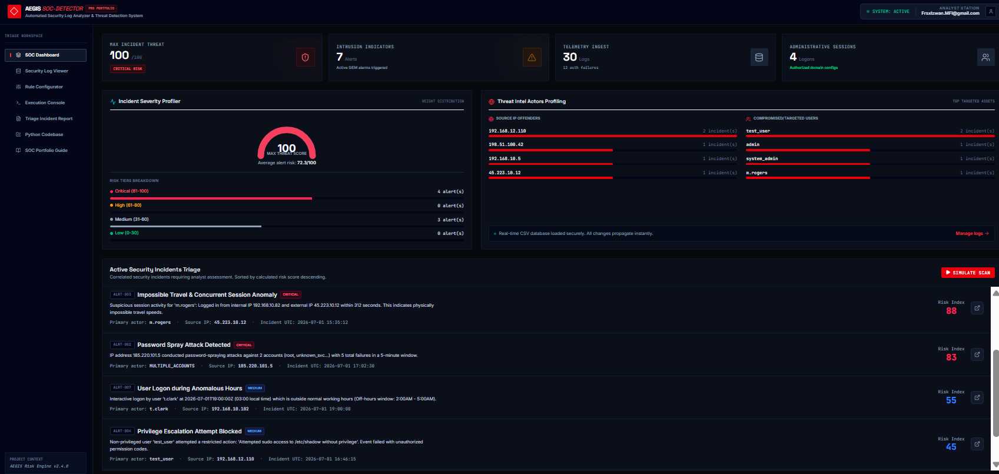

🛡️ SOC Sentinel: Automated Security Log Analyzer & Threat Detection Engine
📌 Overview

SOC Sentinel is a Python-based Security Operations Center (SOC) simulation tool designed to automatically analyze system logs, detect suspicious activity, and generate structured incident reports. It mimics real-world SOC workflows used in cybersecurity operations.

🚨 Features
Log parsing from CSV-based security logs
Detection of brute force attacks and suspicious login behavior
Risk scoring system (0–100 severity scale)
SOC-style incident report generation
Real-time threat detection output
Modular architecture for scalability

🧠 Threat Detection Capabilities
Brute force attack detection
Multiple IP login anomaly detection
Privilege escalation pattern detection
Unusual login time detection
Repeated authentication failure analysis

⚙️ Tech Stack
Python 3.x
No external APIs required
CSV-based log processing
